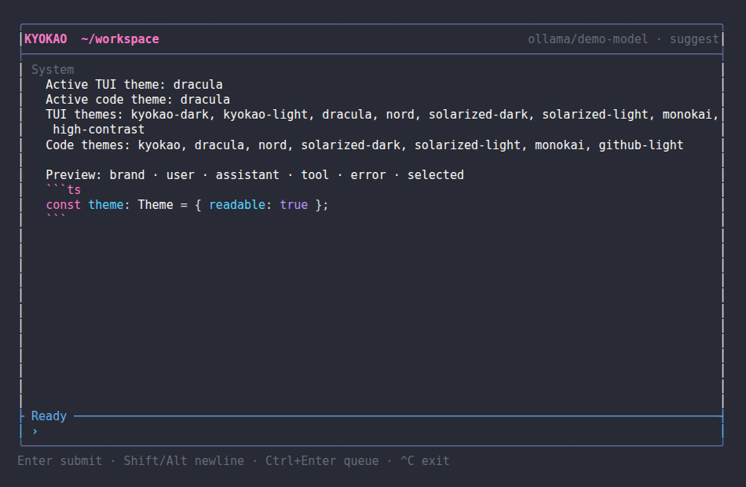
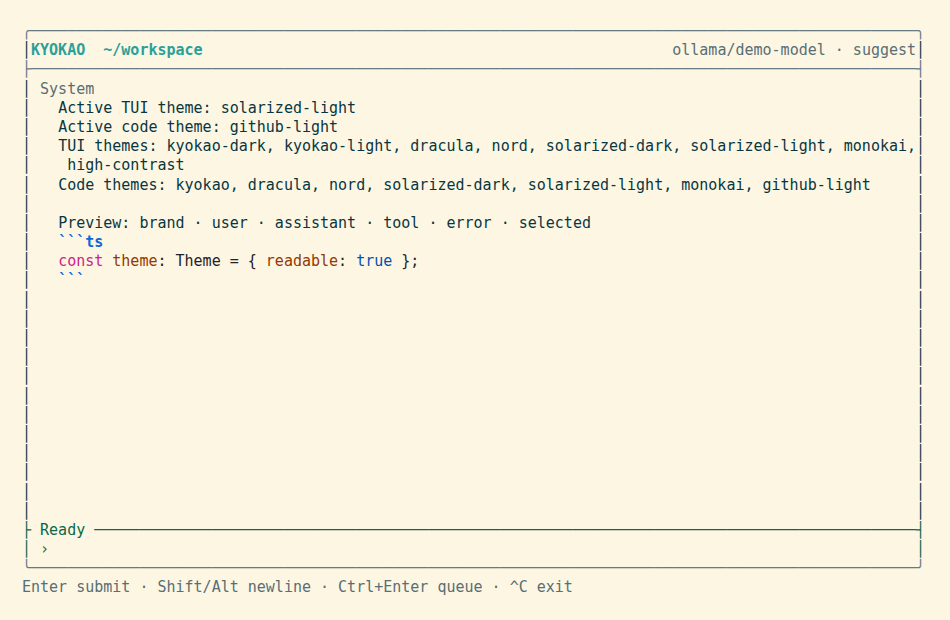

# Kyokao

Kyokao is a TypeScript coding-agent CLI with two first-class execution modes: a permissioned local tool loop using OpenAI-compatible APIs, and Capy's remote agent API for connected repositories and isolated VMs.

It is a local command-line application with a full-screen terminal interface. Review generated changes before keeping or committing them.

## Contents

- [Features](#features)
- [Requirements and installation](#requirements-and-installation)
- [Quickstart](#quickstart)
- [CLI reference](#cli-reference)
- [Providers](#providers)
- [Configuration](#configuration)
- [Approvals and safety](#approvals-and-safety)
- [Sessions, memory, and workflows](#sessions-memory-and-workflows)
- [Development and verification](#development-and-verification)
- [Architecture](#architecture)
- [Security and local data](#security-and-local-data)
- [Troubleshooting](#troubleshooting)
- [Contributing and license](#contributing-and-license)

## Features

- OpenAI-compatible local provider client and a native Capy remote-agent backend.
- Concurrent TUI composition with cancellation-safe replacement and FIFO queued follow-ups.
- Immutable dark/light TUI and code themes with live switching and ANSI-aware Markdown/syntax rendering.
- Built-in presets for hosted and local endpoints; custom OpenAI-compatible endpoints are supported.
- One-shot prompts, piped prompts, and a persistent full-screen interactive session by default.
- Bare `kyokao`, `kyokao chat`, and `kyokao tui` open the same interactive terminal workspace in a TTY.
- Permission modes for file mutations and shell commands.
- Configurable editor launching, repository instruction files, model sampling/fallback controls, and enforceable per-run safety budgets.
- Workspace-scoped file, search, shell, read-only Git, and HTTP GET tools.
- MCP stdio servers and JavaScript ESM plugins can add tools to the same permissioned loop.
- Local JSON sessions that can be listed and resumed, plus a manual key/value memory store.
- Context compression, token/cost estimates, model capability catalog, availability validation, configuration layers, named profiles, model aliases, redacted config inspection/export, and setup diagnostics.
- Headless output formats (`--output-format plain|json|streaming-json`) for bots and scripts.
- Optional sub-agents (`--subagents`) that delegate scoped, read-only-by-default sub-tasks to isolated agent sessions.
- An Agent Client protocol (`kyokao agent-client`) exposing a JSON-RPC 2.0 over stdio wire format for IDE and tool integration.

## Requirements and installation

Kyokao requires **Node.js 20 or later** and **Git**. Building from source uses the repository-pinned package manager, **pnpm 10.31.0**. A global installed package only needs Node.js 20 or later at runtime.

### Build and run from source

```bash
git clone https://github.com/kiyosh11/Kyokao.git kyokao
cd kyokao
corepack enable
pnpm install --frozen-lockfile
pnpm build
export OPENAI_API_KEY='replace-with-your-key'
pnpm --filter kyokao start "inspect this repository"
```

PowerShell:

```powershell
git clone https://github.com/kiyosh11/Kyokao.git kyokao
Set-Location kyokao
corepack enable
pnpm install --frozen-lockfile
pnpm build
$env:OPENAI_API_KEY = 'replace-with-your-key'
pnpm --filter kyokao start "inspect this repository"
```

`pnpm kyokao "..."` is the equivalent root-script shortcut. Run commands from the repository or project directory you want the agent to treat as its workspace.

### Create and install the standalone package

The CLI package is bundled during its build. Packing also copies the root README and license into `packages/cli`.

```bash
pnpm install --frozen-lockfile
pnpm build
pnpm --filter kyokao pack
npm install -g ./kyokao-0.8.0.tgz
kyokao --help
```

The version in the tarball name follows `packages/cli/package.json`; use the actual filename that `pack` prints if it changes. To update a global local-tarball installation, rebuild, pack, and run the same `npm install -g ./<tarball>.tgz` command. To remove it:

```bash
npm uninstall -g kyokao
```

PowerShell uses the same `npm` commands:

```powershell
pnpm --filter kyokao pack
npm install -g .\kyokao-0.8.0.tgz
npm uninstall -g kyokao
```

## Quickstart

Set an API key only in your shell or a secret manager; do not commit it to `~/.kyokao/config.json`.

```bash
export OPENAI_API_KEY='replace-with-your-key'
kyokao "explain the repository structure"
```

A prompt is a one-shot run. Piped standard input is also used as a one-shot prompt:

```bash
printf '%s\n' 'run the relevant tests and report failures' | kyokao
```

For a persistent interactive session, run bare `kyokao`, `kyokao chat`, or `kyokao tui` in a TTY. If no provider is configured, Kyokao first opens its full-screen setup flow. It uses a selectable provider list (Up/Down or `j`/`k`, then Enter), supports local presets and custom OpenAI-compatible endpoints, and moves directly into the workspace after saving. Setup and workspace share one alternate-screen session when the terminal supports it, so completion, cancellation, and errors restore the prior shell display. A safe clearing fallback is used otherwise.

```text
 _  ___   _____  _  __   _    ___
| |/ / | |/ _ \| |/ /  /_\  / _ \
| ' <| |_| | (_) | ' <  / _ \| (_) |
|_|\_\___/ \___/|_|\_\/_/ \_\___/

Choose a provider
› ollama — Local server at http://localhost:11434/v1
  openai — Hosted API (OPENAI_API_KEY)
```

Hosted API-key input is masked. A present preset environment variable is reported as `environment` and is never copied into the config; local Ollama, LM Studio, and vLLM presets do not require a key. The review screen shows only a key source (`environment`, `saved`, or `not configured`), not key contents. Setup writes the selected provider, model, and approval mode to `~/.kyokao/config.json`, preserving unrelated global settings. A manually entered key is stored locally with mode `0600`; prefer an environment variable when feasible. Re-run the flow with `kyokao setup`.

```bash
kyokao
# setup: Up/Down or j/k select, Enter continues, Escape goes back, Ctrl-C cancels
# workspace: Enter submits/replaces; Shift/Alt-Enter or Ctrl-J inserts a newline; Tab queues while busy
# type / to filter commands, then use Up/Down and Enter
```

The bordered composer remains editable while an agent runs. Enter cancels/stops the active turn and starts the new prompt before existing queued work; Tab queues without interruption. Shift-Enter inserts a newline when the terminal reports CSI-u or xterm `modifyOtherKeys`; Alt-Enter is the compatibility fallback, and Ctrl-J also inserts a newline. Bracketed multiline paste remains literal. `/queue`, `/queue clear`, and `/queue retry` inspect, clear, and retry pending work.

The workspace keeps one local session until `/new`. It streams provider output, tool activity, and tool results into a timestamped transcript. The live strip shows elapsed activity, token usage, and the stop control. The bordered composer stays pinned to the bottom with the active model and approval mode. The keyboard legend sits on the left of the footer and the context counter is right-aligned. Escape interrupts an active prompt; Ctrl-C cancels while busy and exits while idle. Ctrl-T opens the transcript view, Ctrl-G opens the draft in the configured editor, Ctrl-O copies the last response, Ctrl-L clears the visible transcript, and `?` opens the shortcut view. Ctrl-R/Ctrl-S browse history, while standard Emacs editing bindings are supported. On exit, the restored shell receives a resumable session command; `/new` clears that hint.

| Slash command                                                                             | Purpose                                                                                                                                                                                                                                                                    |
| ----------------------------------------------------------------------------------------- | -------------------------------------------------------------------------------------------------------------------------------------------------------------------------------------------------------------------------------------------------------------------------- |
| `/help [command]`                                                                         | Show command help and argument syntax.                                                                                                                                                                                                                                     |
| `/new`, `/clear`, `/exit`, `/quit`                                                        | Start a new session, clear visible output, or leave the workspace.                                                                                                                                                                                                         |
| `/sessions`, `/resume <id>`                                                               | List or resume local sessions.                                                                                                                                                                                                                                             |
| `/fork`, `/archive`, `/archive list`, `/archive restore`, `/delete`, `/rollout`           | Fork, archive, restore, confirm-delete, or inspect the storage record for a saved session. Capy archive/restore actions are also sent to the remote thread API.                                                                                                            |
| `/model [id]`, `/provider [name [model]\|key]`, `/approval [mode]`, `/permissions [mode]` | Inspect or change the active runtime setting. Provider selection reuses saved credentials; a model can be supplied when switching providers, and `/provider key` explicitly replaces the active provider's token. Approval accepts `suggest`, `auto-edit`, or `full-auto`. |
| `/memory [list\|set <key> <value>\|delete <key>]`                                         | Inspect or manage local memory.                                                                                                                                                                                                                                            |
| `/goal`, `/personality`, `/skills`, `/mention`, `/init`, `/import`                        | Set session instructions, invoke installed skills, mention workspace files, or create/import `AGENTS.md`.                                                                                                                                                                  |
| `/doctor`, `/diff`, `/review [instructions]`                                              | Run setup diagnostics, show the workspace diff, or start a code review.                                                                                                                                                                                                    |
| `/queue [clear\|retry]`, `/capy`                                                          | Manage pending prompts or show Capy project/thread/task/PR status.                                                                                                                                                                                                         |
| `/threads [query]`, `/task <id>`, `/diff <taskId>`                                        | Browse Capy threads, inspect a task, or render its remote diff.                                                                                                                                                                                                            |
| `/tags [list\|set\|create]`, `/usage [orgId] [from] [to]`                                 | Manage Capy thread tags or inspect API usage for an ISO/date range.                                                                                                                                                                                                        |
| `/context`, `/status`, `/compact`, `/rewind`                                              | Inspect session/context status, compress saved history, or remove the latest turn.                                                                                                                                                                                         |
| `/plan`, `/view-plan`, `/rename <title>`, `/copy`                                         | Manage the saved plan/title or copy the latest assistant response.                                                                                                                                                                                                         |
| `/settings`                                                                               | Open the persistent settings picker above the composer. Toggle thinking/subagents directly or choose provider, model, NVIDIA reasoning effort, permissions, TUI theme, and code theme.                                                                                     |
| `/mcp`, `/plugins`, `/keymap`                                                             | Inspect configured integrations or show the active Codex-compatible keyboard map.                                                                                                                                                                                          |
| `/ps`, `/stop`, `/raw`, `/debug-config`, `/subagents`, `/apps`, `/logout`                 | Inspect/control active work, open the raw transcript, diagnose redacted configuration, manage local subagents/integrations, or remove a saved provider key.                                                                                                                |

Kyokao recognizes the current Codex commands relevant to its terminal workflow. Commands that require a Codex-only IDE, desktop bridge, Vim editor, hook engine, additional sandbox roots, side conversations, or status-line customization report that the capability is unavailable; they never claim a no-op succeeded.

Finite choices open as arrow-selectable drop-ups inside the composer. `/help` browses command help, `/model` includes fetched provider models and aliases, `/resume` shows saved sessions, and `/memory delete` shows existing keys. Provider rows show only provider names; selecting one opens masked token entry in the same composer. Capy then presents the API token’s accessible projects, Captain-eligible models, and Build models as separate scrollable choices before activation. The order is key → project → Captain model → Build model, matching Capy’s `projectId`, `model`, and `buildModel` thread fields. Enter saves the completed provider selection to the user’s global Kyokao config, while Escape cancels. Token text is never rendered, added to prompt history, or written to the transcript.

Unknown slash commands are rejected locally and are never sent to the model. One-shot prompts and piped standard input remain script-friendly and do not start the workspace.

From source, replace `kyokao` in the examples with `pnpm --filter kyokao start`:

```bash
pnpm --filter kyokao start chat
pnpm --filter kyokao start -p groq -m llama-3.3-70b-versatile "inspect this repository"
```

## CLI reference

`kyokao --help` is the installed CLI’s authoritative command list. The global options are:

| Option                   | Meaning                                                                                                                                                                                                                    |
| ------------------------ | -------------------------------------------------------------------------------------------------------------------------------------------------------------------------------------------------------------------------- |
| `-m, --model <id>`       | Model ID or configured alias.                                                                                                                                                                                              |
| `-p, --provider <name>`  | Built-in preset or configured provider name.                                                                                                                                                                               |
| `--base-url <url>`       | Override the selected provider base URL for this invocation.                                                                                                                                                               |
| `--api-key <key>`        | Override the API key for this invocation; it is not persisted. Avoid putting secrets in shell history.                                                                                                                     |
| `--approval <mode>`      | `suggest`, `auto-edit`, or `full-auto`.                                                                                                                                                                                    |
| `--theme <name>`         | TUI theme for this invocation.                                                                                                                                                                                             |
| `--code-theme <name>`    | Fenced code and Markdown theme for this invocation.                                                                                                                                                                        |
| `--profile <name>`       | Select a configuration profile.                                                                                                                                                                                            |
| `--max-iterations <n>`   | Agent loop limit; an integer from 1 through 100.                                                                                                                                                                           |
| `--temperature <n>`      | Sampling temperature from 0 through 2.                                                                                                                                                                                     |
| `--max-tokens <n>`       | Maximum completion tokens.                                                                                                                                                                                                 |
| `--top-p <n>`            | Nucleus sampling probability from greater than 0 through 1.                                                                                                                                                                |
| `--fallback-model <ids>` | Comma-separated model IDs to try after a provider failure.                                                                                                                                                                 |
| `--editor <command>`     | Editor command for this invocation.                                                                                                                                                                                        |
| `--max-cost <usd>`       | Stop after the estimated run cost reaches this amount; 0 means unlimited.                                                                                                                                                  |
| `--output-format <fmt>`  | Headless output format: `plain` (human text), `json` (single aggregated object), or `streaming-json` (one NDJSON line per event). Default honors an explicit value, else `plain` in a TTY and `streaming-json` when piped. |
| `--subagents`            | Enable the `spawn_subagent` tool so the agent can delegate scoped sub-tasks to isolated sub-agents. Off by default.                                                                                                        |
| `-V, --version`          | Print the CLI version.                                                                                                                                                                                                     |
| `-h, --help`             | Print help.                                                                                                                                                                                                                |

The default invocation accepts `[prompt...]`: with words it runs them as one prompt; without words it starts the terminal workspace in a TTY, or reads all piped standard input otherwise. `kyokao --help` prints the authoritative, section-grouped command list. Commands are organized under headers (Interactive, Agent-assisted, Configuration, Sessions & memory, Providers & themes, Listings, Diagnostics, Integration).

| Group              | Command                           | What it does                                                                                           | Example                                        |
| ------------------ | --------------------------------- | ------------------------------------------------------------------------------------------------------ | ---------------------------------------------- |
| Interactive        | `[prompt...]` (default)           | Run a prompt; TTY opens the workspace, otherwise one-shot or piped.                                    | `kyokao "explain this repo"`                   |
| Interactive        | `run [prompt...]`                 | Explicit headless entry (alias of the bare invocation).                                                | `kyokao run "ship it" --output-format json`    |
| Interactive        | `tui`                             | Start the interactive terminal workspace.                                                              | `kyokao tui`                                   |
| Agent-assisted     | `commit [prompt...]`              | Review changes, run checks, then create a commit if ready. Flags: `-m, --message <m>`, `--no-verify`.  | `kyokao commit -m "fix login"`                 |
| Agent-assisted     | `review [prompt...]`              | Review current changes for bugs, security risks, and missing tests. Flag: `-b, --base <ref>`.          | `kyokao review --base main`                    |
| Agent-assisted     | `test [prompt...]`                | Run relevant tests and safely diagnose/fix failures. Accepts `-- <test-args>` passthrough.             | `kyokao test -- --grep auth`                   |
| Agent-assisted     | `explain [prompt...]`             | Explain repository structure and relevant implementation.                                              | `kyokao explain "focus on config"`             |
| Configuration      | `setup`                           | Run the first-run provider, model, and project setup wizard.                                           | `kyokao setup`                                 |
| Configuration      | `config show`                     | Print the resolved non-profile config with secrets redacted.                                           | `kyokao config show`                           |
| Configuration      | `config path`                     | Print the global config file path.                                                                     | `kyokao config path`                           |
| Configuration      | `config export <file>`            | Atomically write a redacted resolved config to a file.                                                 | `kyokao config export /tmp/kyokao.json`        |
| Sessions & memory  | `session list`                    | List local sessions for the current workspace.                                                         | `kyokao session list`                          |
| Sessions & memory  | `session resume <id> [prompt...]` | Resume a session; with a prompt, send it as a follow-up.                                               | `kyokao session resume 123e4567 "continue"`    |
| Sessions & memory  | `memory` (bare)                   | List all saved memory keys and values (alias of `memory list`).                                        | `kyokao memory`                                |
| Sessions & memory  | `memory set <key> <value>`        | Save a string value under a key.                                                                       | `kyokao memory set convention "use pnpm"`      |
| Sessions & memory  | `memory delete <key>`             | Delete a saved memory key.                                                                             | `kyokao memory delete convention`              |
| Providers & themes | `provider use <name> [model]`     | Switch providers using an explicit or previously saved model; incomplete Capy selections are rejected. | `kyokao provider use openrouter openai/gpt-4o` |
| Providers & themes | `provider list`                   | List built-in and configured providers.                                                                | `kyokao provider list`                         |
| Providers & themes | `theme save [tui] [code]`         | Persist the active TUI and code themes globally.                                                       | `kyokao theme save`                            |
| Providers & themes | `theme list`                      | Preview all built-in TUI and code themes.                                                              | `kyokao theme list`                            |
| Listings           | `models [--known]`                | List live provider models; Capy rows identify Captain + Build or Build-only eligibility.               | `kyokao -p openrouter models`                  |
| Listings           | `providers`                       | List built-in provider presets.                                                                        | `kyokao providers`                             |
| Listings           | `themes`                          | Preview all built-in TUI and code themes.                                                              | `kyokao themes`                                |
| Listings           | `plugins`                         | List configured plugin modules.                                                                        | `kyokao plugins`                               |
| Listings           | `mcp`                             | List configured MCP stdio servers.                                                                     | `kyokao mcp`                                   |
| Listings           | `usage [id]`                      | Print token/cost/compression usage for one or all sessions.                                            | `kyokao usage`                                 |
| Diagnostics        | `doctor`                          | Print Node version, workspace, provider URL, credentials, sandbox, and model availability.             | `kyokao doctor`                                |
| Diagnostics        | `diff`                            | Display the working-tree diff via the read-only Git tool.                                              | `kyokao diff`                                  |
| Integration        | `agent-client`                    | Drive the agent over a JSON-RPC 2.0 stdio protocol for IDE/bot integration.                            | `kyokao agent-client`                          |
| Utility            | `edit <path>`                     | Open a workspace file in the configured editor.                                                        | `kyokao edit src/index.ts`                     |

**Hidden back-compat aliases** (not in `--help`, still work): `chat` → `tui`, `catalog` → `models --known`, `sessions` → `session list`, `resume <id> <prompt...>` → `session resume`, `config setup` → `setup`, bare `memory` → `memory list`.

### Custom agent-assisted commands

`commit`, `review`, `test`, and `explain` are backed by prompt templates you can override or extend. Drop a Markdown file in `~/.kyokao/commands/<name>.md` — the first line is the description shown in `--help`, the rest is the prompt body. Placeholders:

- `{{args}}` — the joined prompt arguments
- `{{flags.<name>}}` — a named flag's value (e.g. `{{flags.message}}`)
- `{{#flags.<name>}}…{{/flags.<name>}}` — conditional block, included only when the flag is set
- `{{#passthrough}}…{{/passthrough}}` and `{{passthrough}}` — for commands accepting `-- <args>`

A user `commit.md` overrides the built-in `commit`; a new file like `refactor.md` adds a brand-new `kyokao refactor` command. Built-in flag specs (`-m, --message` for `commit`, `-b, --base` for `review`, `--` passthrough for `test`) still apply to overridden templates.

`commit`, `test`, and `review` are prompts to the agent, not dedicated Git or test engines. Their ability to change files or run commands depends on the selected approval mode.

## Providers

OpenAI-compatible presets supply a base URL and API-key environment-variable name. The `capy` preset instead uses Capy's native models, projects, threads, messages, and stop endpoints.

| Preset       | Base URL                                | API-key environment variable | Example model string                      |
| ------------ | --------------------------------------- | ---------------------------- | ----------------------------------------- |
| `capy`       | `https://capy.ai/api/v1`                | `CAPY_API_KEY`               | dynamically discovered Captain model      |
| `openai`     | `https://api.openai.com/v1`             | `OPENAI_API_KEY`             | `gpt-4o-mini`                             |
| `openrouter` | `https://openrouter.ai/api/v1`          | `OPENROUTER_API_KEY`         | `openai/gpt-4o-mini`                      |
| `groq`       | `https://api.groq.com/openai/v1`        | `GROQ_API_KEY`               | `llama-3.3-70b-versatile`                 |
| `nvidia`     | `https://integrate.api.nvidia.com/v1`   | `NVIDIA_API_KEY`             | `meta/llama-3.1-70b-instruct`             |
| `together`   | `https://api.together.xyz/v1`           | `TOGETHER_API_KEY`           | `meta-llama/Llama-3.3-70B-Instruct-Turbo` |
| `deepinfra`  | `https://api.deepinfra.com/v1/openai`   | `DEEPINFRA_API_KEY`          | provider-controlled ID                    |
| `fireworks`  | `https://api.fireworks.ai/inference/v1` | `FIREWORKS_API_KEY`          | provider-controlled ID                    |
| `cerebras`   | `https://api.cerebras.ai/v1`            | `CEREBRAS_API_KEY`           | provider-controlled ID                    |
| `sambanova`  | `https://api.sambanova.ai/v1`           | `SAMBANOVA_API_KEY`          | provider-controlled ID                    |
| `xai`        | `https://api.x.ai/v1`                   | `XAI_API_KEY`                | `grok-2-latest`                           |
| `mistral`    | `https://api.mistral.ai/v1`             | `MISTRAL_API_KEY`            | `mistral-small-latest`                    |
| `ollama`     | `http://localhost:11434/v1`             | `OLLAMA_API_KEY`             | `llama3.2`                                |
| `lmstudio`   | `http://localhost:1234/v1`              | `LMSTUDIO_API_KEY`           | local server model ID                     |
| `vllm`       | `http://localhost:8000/v1`              | `VLLM_API_KEY`               | served model ID                           |

The example strings are passed through unchanged; they are not a claim that a provider currently serves them.

### Capy remote-agent mode

Run `kyokao config setup`, select `capy`, then choose an accessible project plus dynamically fetched Captain and Build models. The saved `projectId` maps work to that project's connected repositories. In the TUI, `/settings` exposes both role-specific model pickers and keeps the current thread when either changes. The first prompt creates a Capy thread; later prompts and `/resume` continue that thread, sending both model selections on every turn. `models` shows the full live Capy model list with role eligibility, and `doctor` validates the token, both models, and project access without starting paid work.

When the API key has Capy billing/usage permission, the composer displays the selected project's paid month-to-date spend and refreshes it after completed work. `/usage` shows the project total split into LLM and VM spend; `/usage <orgId> [from] [to]` retains the detailed organization/date-range query. Keys without billing access continue normally and `/usage` reports that the extra permission is required.

Capy mode does **not** inspect or modify uncommitted files in the directory where Kyokao is launched. It operates on the selected Capy project's connected repositories inside Capy-managed remote VMs. Use `/capy` for live run state, waiting/blocking reasons, tasks, and PR links; `/threads`, `/task`, `/diff <taskId>`, `/tags`, and `/usage` expose the related remote records.

Optional defaults for newly created Capy threads use the same values as the published API:

```json
{
  "providers": {
    "capy": {
      "projectId": "project-id",
      "speed": "fast",
      "buildModel": "gpt-5.6-terra",
      "buildSpeed": "standard",
      "repos": [{ "repoFullName": "owner/repo", "branch": "main" }],
      "tags": ["cli"]
    }
  }
}
```

`speed` and `buildSpeed` accept `fast` or `standard`. Tags are existing tag names, not color objects; create reusable tags with `/tags create <name> [color]`.

### Provider command examples

These examples use the preset URLs exactly as implemented. Substitute a model ID accepted by the service, and use a key only where that endpoint requires one.

```bash
export OPENAI_API_KEY='replace-with-your-key'
kyokao -p openai -m gpt-4o-mini "explain this project"

export OPENROUTER_API_KEY='replace-with-your-key'
kyokao -p openrouter -m openai/gpt-4o-mini "explain this project"

export GROQ_API_KEY='replace-with-your-key'
kyokao -p groq -m llama-3.3-70b-versatile "explain this project"

export NVIDIA_API_KEY='replace-with-your-key'
kyokao -p nvidia -m meta/llama-3.1-70b-instruct "explain this project"

export MISTRAL_API_KEY='replace-with-your-key'
kyokao -p mistral -m mistral-small-latest "explain this project"

export XAI_API_KEY='replace-with-your-key'
kyokao -p xai -m grok-2-latest "explain this project"

export TOGETHER_API_KEY='replace-with-your-key'
kyokao -p together -m meta-llama/Llama-3.3-70B-Instruct-Turbo "explain this project"

kyokao -p ollama -m llama3.2 "explain this project"
kyokao -p lmstudio -m your-loaded-model "explain this project"
kyokao -p vllm -m your-served-model "explain this project"
```

PowerShell environment assignment syntax differs:

```powershell
$env:OPENAI_API_KEY = 'replace-with-your-key'
kyokao -p openai -m gpt-4o-mini "explain this project"

$env:OLLAMA_API_KEY = 'optional-if-your-local-server-requires-it'
kyokao -p ollama -m llama3.2 "explain this project"
```

## Configuration

Kyokao reads JSON only. Configuration is resolved in this order, with later defined values taking precedence:

1. Built-in defaults: `openai`, `gpt-4o-mini`, `auto-edit`, `kyokao-dark`, `kyokao`, 12 iterations, a 16,000-token context budget, and compression at 80% of that budget.
2. Global configuration at `~/.kyokao/config.json`.
3. The selected profile, if `--profile <name>` names an existing profile.
4. Environment, including `KYOKAO_THEME`, `KYOKAO_CODE_THEME`, `KYOKAO_PROVIDER`, `KYOKAO_MODEL`, `KYOKAO_APPROVAL`, `KYOKAO_MAX_ITERATIONS`, `KYOKAO_EDITOR`, `KYOKAO_TEMPERATURE`, `KYOKAO_MAX_TOKENS`, `KYOKAO_TOP_P`, and `KYOKAO_FALLBACK_MODELS`.
5. CLI options, including `--theme`, `--code-theme`, `--context-window`, model sampling flags, editor selection, and safety limits.

> **0.7.0 change:** workspace `.kyokao.json` overrides are no longer read. All state (config, sessions, memory, instructions, custom commands) lives under `~/.kyokao/`. Use [profiles](#configuration) for scoped settings. See [MIGRATION.md](MIGRATION.md) for the upgrade path.

The global config path is `~/.kyokao/config.json` on all platforms. Override the home directory with the `KYOKAO_HOME` environment variable for testing or non-standard layouts. Use `kyokao config path` to print the active path. The application does not create a config file automatically.

### Schema and examples

The supported top-level keys are `theme`, `codeTheme`, `provider`, `model`, `approval`, `maxIterations`, `profiles`, `providers`, `aliases`, `mcp`, `plugins`, `contextWindow`, `compressionThreshold`, `temperature`, `maxTokens`, `topP`, `fallbackModels`, `editor`, `editorArgs`, `limits`, `subagents`, and `tui`. `contextWindow` is the local agent's compression budget, not the model-capacity label in the TUI; the footer resolves model capacity from live API metadata or verified provider catalogs and shows `?` when the provider publishes no limit. `tui.showThinking` defaults to `true`. `/settings thinking off` hides streamed reasoning; with NVIDIA GPT-OSS it also selects the API's lowest supported reasoning effort (`low`) because that API has no `off` value. Provider entries support the common transport/model options plus `reasoningEffort` (`low`, `medium`, or `high`) and `timeoutMs` (up to 600000). Request timeout defaults are 60 seconds for NVIDIA and 120 seconds for other OpenAI-compatible providers; a timeout is retried once rather than entering the general three-attempt retry path. NVIDIA reasoning remains in the local transcript but is stripped from later NVIDIA requests. For NVIDIA GPT-OSS follow-ups, completed turns are encoded as reference history while current-turn tool calls remain structured, avoiding the NIM Harmony multi-turn parser failure present on affected hosted versions. The Capy entry requires `projectId` and may also contain `speed`, `buildModel`, `buildSpeed`, `repos`, and `tags`.

A project configuration without secrets:

```json
{
  "theme": "solarized-light",
  "codeTheme": "github-light",
  "provider": "openai",
  "model": "gpt-4o-mini",
  "approval": "auto-edit",
  "maxIterations": 12,
  "contextWindow": 16000,
  "compressionThreshold": 0.8,
  "temperature": 0.2,
  "maxTokens": 2000,
  "fallbackModels": ["gpt-4o"],
  "providers": {
    "nvidia": {
      "reasoningEffort": "low",
      "timeoutMs": 120000
    }
  },
  "tui": {
    "showThinking": true
  },
  "editor": "code",
  "editorArgs": ["--wait"],
  "limits": {
    "maxToolCalls": 100,
    "maxShellTimeoutMs": 120000,
    "maxOutputChars": 30000,
    "maxFileBytes": 2000000,
    "maxCostUsd": 5,
    "allowedHosts": ["api.example.com"]
  },
  "aliases": {
    "fast": "gpt-4o-mini"
  },
  "profiles": {
    "review": {
      "approval": "suggest",
      "maxIterations": 6
    }
  }
}
```

Use an alias with `-m fast` and a profile with `--profile review`. Profiles can also contain the same supported keys, including their own `providers` and `aliases`; selected profile values are merged after global and project configuration, before environment and CLI overrides.

### Themes and terminal color

Run `kyokao themes` for compact previews. TUI themes are `kyokao-dark`, `kyokao-light`, `dracula`, `nord`, `solarized-dark`, `solarized-light`, `monokai`, and `high-contrast`. Code themes are `kyokao`, `dracula`, `nord`, `solarized-dark`, `solarized-light`, `monokai`, and `github-light`.

Inside the workspace, themes live only under `/settings`; there is no separate `/theme` slash command. Choose **TUI theme** or **Code theme** to browse named options such as **Kyokao Dark**, **Solarized Light**, and **GitHub Light**. Selecting one changes the active theme immediately and atomically saves both theme IDs to global configuration while retaining unrelated settings. Theme switching is render-only: it does not rebuild the provider/backend, cancel work, reset Capy state, or alter the session/queue.

Kyokao negotiates ANSI 16, 256-color, or truecolor from `TERM` and `COLORTERM`. `NO_COLOR` always disables color. Non-TTY output is plain unless the established `FORCE_COLOR` or `CLICOLOR_FORCE` convention explicitly enables color. Themes do not force a terminal background, so light themes remain legible on light terminals.

Markdown rendering styles headings, emphasis, inline code, links, lists, blockquotes, rules, and fenced blocks. Fences support TypeScript/JavaScript, Python, JSON, Bash/shell, Go, Rust, Java/C/C++, HTML/XML, CSS, YAML, SQL, Markdown, and diff. Tokenization is intentionally lightweight rather than a complete parser: nested language grammars, shell heredocs, template-language embeddings, and every malformed construct are not fully modeled. Incomplete strings/comments/fences fail closed as one token, and stripping ANSI reproduces the original source exactly.





### Custom OpenAI-compatible provider

Register the endpoint name and URL in global or project configuration. Do **not** add an `apiKey` to a shared project file.

```json
{
  "provider": "acme",
  "providers": {
    "acme": {
      "baseURL": "https://api.example.test/v1",
      "model": "acme-code-model"
    }
  }
}
```

Custom provider names have no dedicated environment-variable mapping. Keep the secret in an environment variable and pass it for the invocation, including the base URL. Passing both is important because a CLI provider override replaces that provider’s config entry for the invocation.

```bash
export ACME_API_KEY='replace-with-your-key'
kyokao -p acme \
  --base-url 'https://api.example.test/v1' \
  --api-key "$ACME_API_KEY" \
  -m acme-code-model \
  "inspect this repository"
```

PowerShell:

```powershell
$env:ACME_API_KEY = 'replace-with-your-key'
kyokao -p acme --base-url 'https://api.example.test/v1' --api-key $env:ACME_API_KEY -m acme-code-model "inspect this repository"
```

`--api-key` is never written by Kyokao. It can still be exposed by shell history or process inspection depending on the operating system, so prefer a shell/session with appropriate secret-handling controls. `config show` and `config export` redact field names containing `key`, `token`, `secret`, or `password`.

### Plugins and MCP

Plugins are JavaScript ESM modules listed in `plugins`. Each module exports a default object with a `name`, `tools` array using OpenAI function-tool definitions, and an async `execute(name, args)` function that returns `{ content, isError? }`. Relative paths resolve from the workspace.

MCP servers use the stdio transport and are configured under `mcp`:

```json
{
  "plugins": ["./.kyokao/plugins/linear.mjs"],
  "mcp": {
    "filesystem": {
      "command": "npx",
      "args": ["-y", "@modelcontextprotocol/server-filesystem", "/workspace"]
    }
  }
}
```

MCP tools are namespaced as `mcp_<server>_<tool>` before they reach the model. Server processes inherit the current environment plus configured `env` values and are terminated when the CLI exits.

### Editor and repository instructions

`edit <path>` uses `editor`, then `VISUAL`, then `EDITOR`, and finally `vi` (or `notepad` on Windows). `editorArgs` are appended to the command; include `{file}` when the editor needs the file in a specific argument position, otherwise Kyokao appends it.

At startup Kyokao loads instruction files from two locations. **Repository conventions** are read from the workspace root: `SOUL.md`, `CLAUDE.md`, `AGENTS.md`, `KYOKAO.md` (case-insensitive, loaded once per name). **User-level Kyokao instructions** are read from `~/.kyokao/instructions.md` and `~/.kyokao/soul.md`. Their content is bounded before it is added to the system prompt, while the session transcript remains unchanged.

### Headless output formats

`--output-format` selects how non-interactive runs render output. It is ignored in the TUI.

| Format           | Behavior                                                                                                                                 |
| ---------------- | ---------------------------------------------------------------------------------------------------------------------------------------- |
| `plain`          | Human text via the renderer (the default when stdout is a TTY, or when piped for back-compat).                                           |
| `streaming-json` | One NDJSON line per backend event as it arrives: `{kind, value, ts}` where `kind` is `assistant`, `tool`, `usage`, `status`, or `error`. |
| `json`           | A single aggregated object emitted at the end: `{events, session, answer}`.                                                              |

The default is `plain` in a TTY and `streaming-json` when piped, unless an explicit format is given (which always wins). Examples:

```bash
kyokao --output-format streaming-json "explain the repo" | jq 'select(.kind=="assistant")'
echo "summarize this file" | kyokao --output-format json > result.json
```

### Sub-agents

`--subagents` (or `subagents.enabled: true` in `~/.kyokao/config.json`) exposes a `spawn_subagent` tool the agent can call to delegate a scoped sub-task to a fresh, isolated agent session. Sub-agents are off by default because they spend tokens; opt in when the workflow benefits from focused exploration that would otherwise pollute the main transcript.

- **Default grant is read-only:** `read_file`, `list_files`, `glob`, `grep`, `git`. The sub-agent cannot mutate the workspace unless the caller explicitly grants `write_file`, `apply_patch`, `shell`, or `http_get`.
- **Budget isolation:** each spawn gets its own iteration cap (default 8) and a cost cap that is the smaller of the caller-provided `maxCostUsd` and the parent's remaining budget. A sub-agent can never overshoot the parent.
- **Transcript isolation:** only the sub-agent's final assistant answer is returned to the parent. Its intermediate turns live in its own session.

Example tool call the model might emit:

```json
{
  "name": "spawn_subagent",
  "arguments": {
    "prompt": "Find every caller of the loadConfig function and report file:line for each.",
    "maxIterations": 5
  }
}
```

### Agent Client protocol

`kyokao agent-client` drives the agent over a JSON-RPC 2.0 over stdio NDJSON wire protocol designed for IDE and tool integration.

**Transport:** one JSON object per line on stdin (requests) and stdout (responses + notifications). stderr is reserved for logs.

**Client → server requests:**

| Method           | Params                                 | Result                                            |
| ---------------- | -------------------------------------- | ------------------------------------------------- |
| `initialize`     | `{clientInfo?}`                        | `{protocolVersion, serverInfo, capabilities}`     |
| `session/start`  | `{approvalPolicy?: "never"\|"client"}` | `{sessionId}`                                     |
| `session/resume` | `{sessionId}`                          | `{sessionId}`                                     |
| `turn/run`       | `{prompt}`                             | `{turnId}` (completion arrives via notifications) |
| `turn/interrupt` | `{}`                                   | `{}`                                              |

**Server → client notifications:** `turn/started`, `turn/completed` (with `status: completed | interrupted | failed`), and one `item/*` per backend event: `item/assistant`, `item/tool`, `item/toolResult`, `item/usage`, `item/status`, `item/error`.

Example session:

```
→ {"jsonrpc":"2.0","id":1,"method":"initialize","params":{}}
← {"jsonrpc":"2.0","id":1,"result":{"protocolVersion":"kyokao-agent-client-1",...}}
→ {"jsonrpc":"2.0","id":2,"method":"session/start","params":{}}
← {"jsonrpc":"2.0","id":2,"result":{"sessionId":"..."}}
→ {"jsonrpc":"2.0","id":3,"method":"turn/run","params":{"prompt":"explain the repo"}}
← {"jsonrpc":"2.0","method":"turn/started","params":{"turnId":"..."}}
← {"jsonrpc":"2.0","method":"item/assistant","params":{"turnId":"...","text":"Looking at..."}}
← {"jsonrpc":"2.0","method":"item/tool","params":{"turnId":"...","text":"list_files {\"path\":\".\"}"}}
← {"jsonrpc":"2.0","method":"item/toolResult","params":{"turnId":"...","text":"..."}}
← {"jsonrpc":"2.0","method":"turn/completed","params":{"turnId":"...","status":"completed"}}
```

## Approvals and safety

Approval applies to the two file-mutation tools and the shell tool:

| Mode                  | `write_file` / `apply_patch` | `shell`              |
| --------------------- | ---------------------------- | -------------------- |
| `suggest`             | Prompt every action          | Prompt every action  |
| `auto-edit` (default) | Allow without prompt         | Prompt every action  |
| `full-auto`           | Allow without prompt         | Allow without prompt |

A prompt accepts `y` or `yes`; any other response denies the action. In a non-interactive standard input session, prompted actions are denied. Read/search tools, read-only Git subcommands, and HTTP GET do not ask for approval.

`git` only permits the `status`, `diff`, `log`, `show`, and `branch` subcommands through its dedicated tool. A model can request a shell command such as `git commit`; that command is still subject to the shell approval rule above. `http_get` accepts only `http:` and `https:` URLs.

The `limits` object adds hard runtime ceilings: tool calls per run, shell timeout, tool output size, file read/write size, estimated cost, and an optional HTTP host allowlist. `maxCostUsd: 0` disables the cost ceiling; an empty `allowedHosts` list preserves unrestricted HTTP(S) access. Plugin and MCP code is trusted extension code, but its returned output is still bounded before it enters model context.

## Sessions, memory, and workflows

All state lives under `~/.kyokao/` (global, not per-workspace):

- `sessions/<uuid>.json` contains the task, timestamps, transcript, most recent checkpoint, context summary, token/cost usage, and the workspace path the session was created in.
- `memory.json` contains the manual string key/value store used by `memory` commands.

Sessions are **global** — `kyokao session list` shows sessions from all workspaces. Each session records its origin workspace path (the `workspace` field) for future filtering.

List and resume sessions:

```bash
kyokao session list
kyokao session resume 123e4567-e89b-12d3-a456-426614174000 "continue from the last checkpoint"
```

Sessions are saved after completed tool-call iterations and when a run completes. Once a request approaches the configured context budget, older transcript turns are replaced in the provider request by a bounded local summary while the full transcript remains on disk. Provider-reported usage is preferred; endpoints without usage fields receive a local token estimate. `Ctrl+C` aborts the active request; the CLI reports that the last completed tool checkpoint remains saved. The `memory` store is local data management only: this implementation does not automatically inject memory into agent prompts.

Useful review workflows:

```bash
kyokao doctor
kyokao diff
kyokao explain "focus on packages/config"
kyokao test "run the relevant checks"
kyokao review "focus on security and tests"
kyokao commit "commit only if the working tree is ready"
```

## Development and verification

Repository scripts:

| Command             | Check                                                         |
| ------------------- | ------------------------------------------------------------- |
| `pnpm format`       | Checks formatting with Prettier.                              |
| `pnpm format:write` | Rewrites formatting with Prettier.                            |
| `pnpm lint`         | Runs ESLint.                                                  |
| `pnpm typecheck`    | Type-checks every workspace package.                          |
| `pnpm test`         | Runs Vitest once.                                             |
| `pnpm build`        | Builds every workspace package.                               |
| `pnpm kyokao "..."` | Runs the CLI source entry point through its workspace script. |

Run the full local gate used by CI:

```bash
pnpm install --frozen-lockfile
pnpm format
pnpm lint
pnpm typecheck
pnpm test
pnpm build
```

CI runs that gate on Node 20 and 22 across Ubuntu, macOS, and Windows.

### Publish standalone CLI binaries

Push a tag matching the CLI package version to build a GitHub Release:

```bash
git tag v0.8.0
git push origin v0.8.0
```

The release workflow verifies the tag against `packages/cli/package.json`, runs the full test gate, and publishes self-contained Linux x64, macOS x64/ARM64, and Windows x64 archives with SHA-256 checksums. These binaries do not require Node.js on the target machine.

### Verify a release tarball without changing global npm state

```bash
pnpm build
pnpm --filter kyokao pack
TARBALL=kyokao-0.8.0.tgz
PREFIX="$(mktemp -d)"
npm install --prefix "$PREFIX" "$TARBALL"
"$PREFIX/node_modules/.bin/kyokao" --help
rm -rf "$PREFIX"
```

Use the tarball filename output by `pack` if the version differs. PowerShell:

```powershell
pnpm build
pnpm --filter kyokao pack
$tarball = '.\kyokao-0.8.0.tgz'
$prefix = Join-Path $env:TEMP ('kyokao-npm-' + [guid]::NewGuid())
npm install --prefix $prefix $tarball
& (Join-Path $prefix 'node_modules\.bin\kyokao.cmd') --help
Remove-Item -Recurse -Force $prefix
```

## Architecture

| Package             | Responsibility                                                                                    |
| ------------------- | ------------------------------------------------------------------------------------------------- |
| `@kyokao/config`    | Defaults, JSON validation/loading/merging, provider presets, redaction, and atomic config writes. |
| `@kyokao/providers` | OpenAI-compatible chat client plus the independently typed native Capy API client.                |
| `@kyokao/tools`     | Workspace sandbox, core tools, plugins, MCP stdio clients, and tool composition.                  |
| `@kyokao/memory`    | Local session, usage, context-summary, and manual-memory JSON persistence.                        |
| `@kyokao/agent`     | Local/Capy backends, prompt scheduler, context compression, bounded tool loop, and checkpoints.   |
| `@kyokao/themes`    | Immutable semantic TUI/code contracts, built-in registries, and terminal color capability logic.  |
| `@kyokao/ui`        | Scoped themed output, Markdown/token rendering, approval prompts, and full-screen TUI rendering.  |
| `kyokao`            | Commander CLI wiring, commands, and runtime construction.                                         |

For an agent run, the CLI resolves configuration and provider settings, validates the selected model against `/models`, starts configured plugins and MCP servers, creates a workspace sandbox and local store, then sends a system prompt, compacted transcript, and user prompt to the provider. The provider response may stream text and function calls. For each returned call, the agent executes the matching core, plugin, or MCP tool, appends a tool-result message, records usage, saves a checkpoint, and calls the provider again. It stops when no tool calls remain or errors after the configured iteration limit. Transient provider failures are retried up to two times with short exponential backoff; aborts and messages matching certain client/configuration error patterns are not retried. The agent owns this retry loop, so the underlying OpenAI-compatible SDK does not perform a second nested retry loop.

Core tools are `read_file`, `list_files`, `glob`, `grep`, `write_file`, `apply_patch`, `shell`, read-only `git`, and `http_get`. Directory listings omit `.git`, `node_modules`, and `dist`; listing depth is capped at 5 and output is bounded. Shell commands run in the workspace with a requested timeout clamped between 1 second and 2 minutes.

## Security and local data

- File tool paths are resolved against the current workspace and reject traversal, NUL bytes, and resolved symlinks that leave it. This is not a complete defense against filesystem races or all platform-specific filesystem behavior.
- The shell tool intentionally executes arbitrary commands **in the workspace** when approved or in `full-auto`. Treat `full-auto` as high trust.
- The sandbox does not isolate processes, network access, credentials available to subprocesses, or side effects of an approved command. It is a path/permission boundary, not a container or VM.
- Provider requests include prompts, transcripts, tool definitions, and tool results. Use a provider and API key policy appropriate for the repository’s data.
- Session, memory, and atomic config writes use owner-only file mode `0600` where supported, but existing directory permissions and platform semantics still matter.
- API keys are sourced from preset environment variables, an optional config provider `apiKey`, or `--api-key`. Prefer environment variables or a secret manager. Never commit keys.

## Troubleshooting

| Symptom                                                              | Check                                                                                                                                                                                                                                                                 |
| -------------------------------------------------------------------- | --------------------------------------------------------------------------------------------------------------------------------------------------------------------------------------------------------------------------------------------------------------------- |
| `credentials: missing` in `doctor` or provider authentication errors | Export the preset’s exact API-key variable from the provider table, or pass `--api-key` for this invocation. `doctor` reports presence, not validity.                                                                                                                 |
| `Provider baseURL is required`                                       | Select a built-in preset or configure/pass a custom provider `baseURL`. OpenAI-compatible endpoints normally need the `/v1` path because Kyokao appends `/chat/completions` and `/models`.                                                                            |
| `Model listing failed: ...`                                          | Kyokao validates the selected model through the server’s `/models` endpoint and caches successful listings briefly to avoid duplicate startup calls. Verify credentials, URL, and endpoint support, or use `--skip-model-check` when the endpoint cannot list models. |
| Local Ollama, LM Studio, or vLLM connection fails                    | Start the local server, confirm its port (`11434`, `1234`, or `8000` for the presets), verify its OpenAI-compatible `/v1` endpoint, and use the model ID it has loaded/serves.                                                                                        |
| `Invalid config ...`                                                 | Ensure JSON is valid; top-level sections are objects, provider fields and aliases are strings, approval is one of the three modes, and `maxIterations` is an integer 1–100.                                                                                           |
| `Unknown provider: ...`                                              | Use `kyokao providers` for presets, or add a matching name under `providers` in config.                                                                                                                                                                               |
| A request is denied unexpectedly                                     | In `suggest`, every mutation and shell command needs a TTY confirmation. In `auto-edit`, shell still needs confirmation. Piped/non-TTY input denies prompted actions.                                                                                                 |
| Windows shell behavior differs                                       | Shell tool calls use `cmd.exe` (or `ComSpec`) on Windows and `/bin/sh` elsewhere. Use PowerShell only for your own invocation/setup commands; agent shell commands are not PowerShell commands by default.                                                            |
| A run was interrupted                                                | Run `kyokao sessions`, then `kyokao resume <id> "..."` from the same workspace. Only the last completed checkpoint is guaranteed to have been saved.                                                                                                                  |

## Contributing and license

See [CONTRIBUTING.md](CONTRIBUTING.md) for the required local checks. Kyokao is licensed under the [ISC License](LICENSE).
